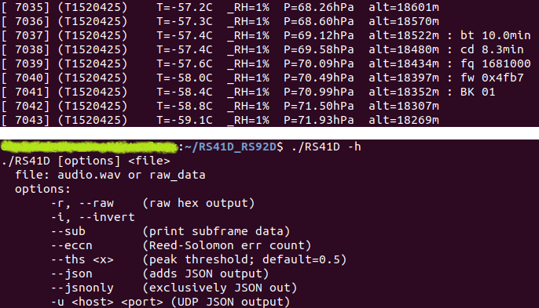

# RS41-D RS92-D decoder

Vaisala RS41-D and RS92-D* radiosonde transmits data in 1680MHz band. Its hardware doesn't incorporate any positioning system, so we can receive only PTU (pressure, temperature and humidity measurements).

Following data is relevant for both types:
 - Tunning range      1668,6 - 1689,8 MHz
 - Output power (high-power mode)  200 mW
 - Modulation       GFSK; Manchester code
 - Windfinding is provided by Radiotheodolite system

## DECODING
These decoders are based on [rs92mod.c](https://github.com/rs1729/RS/blob/master/demod/mod/rs92mod.c) and [rs41mod.c](https://github.com/rs1729/RS/blob/master/demod/mod/rs41mod.c) code by zilog80. They require FM demodulated WAV audio by default. This might be a wave file record or stream provided by [SOX](https://sourceforge.net/projects/sox/) from pipe or from PC audio comming out of SDR application. Output is text and/or json data. It allows sending json over UDP at the same time.

Example of using SoX in windows to stream from virtual audio device:
```
SOX_PATH\sox -q -t waveaudio "CABLE Output" -t wav - 2>nul | RS92D.exe
```
Wave audio file decoding and reporting number of corrected frame bytes (Linux):
```
./RS41D --eccn record.wav
```


## RADIOSONDE HUNTING
Tracking and physically finding radiosonde that does not transmit its position is challenging. Received air pressure data gives us approximate altitude and also allows us to calculate vertical speed. If we know launch location, it is possible to estimate impact location using wind forecast data. RS92-D battery operation time is ~4.5 hours. But the major problem would be that we basically need a direct line of sight to receive signal.
RS41-D seems to have enabled 10min burst timer by default which means it stops transmitting 10 minutes after baloon burst. This makes it pretty impossible to find.